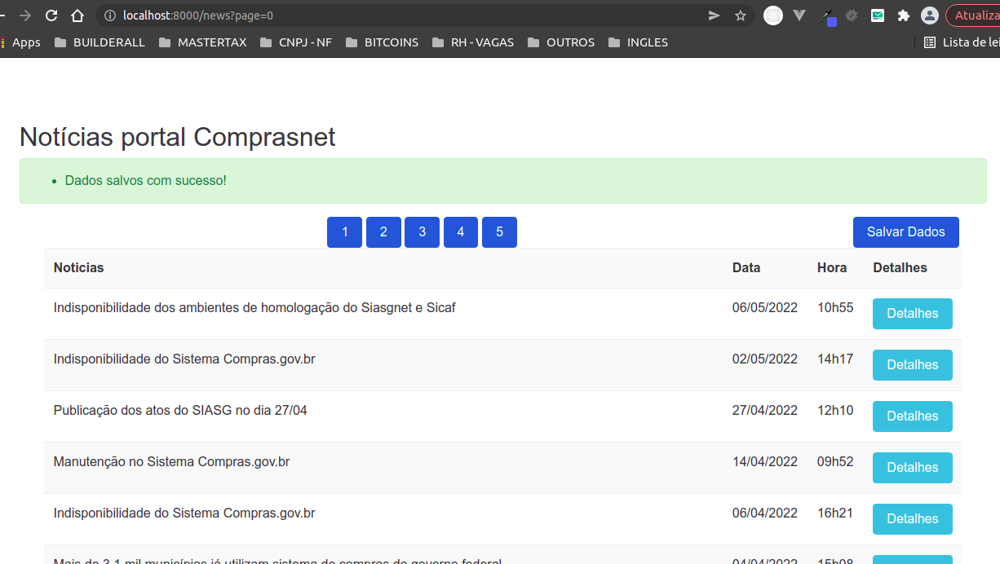
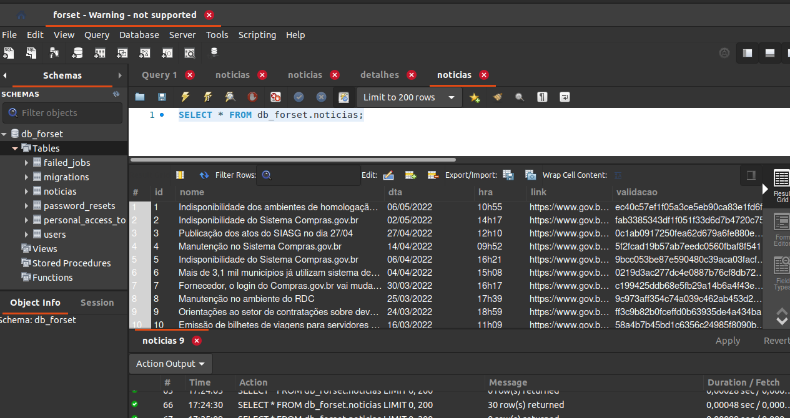
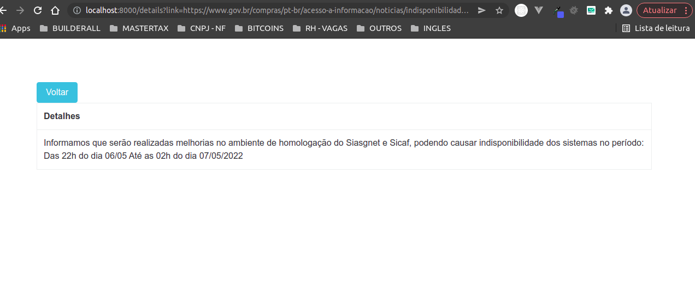
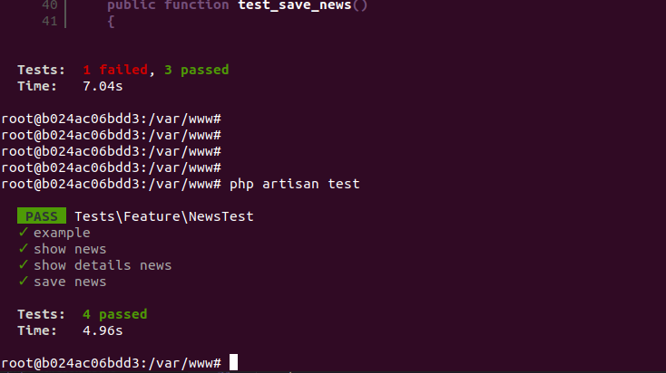

## Instruções

INSTRUCOES PARA RODAR O PROJETO UBUNTO 20.04

criar o arquivo .env ,apartir do env.example

#url da listagem de notícias
http://localhost:8000/news

#rodar e subir os containers docker
docker-compose  up -d

Obs!!!: verificar se os 3 containers startou(appApi,appNginx,appDb), caso nao tenha 
rode novamente: docker-compose  up -d

#Entrar no container docker
docker exec -it appApi bash 

#Dentro do container, executar os comandos abaixo
composer install
php artisan migrate

#rodar os tests
php artisan test

## Imagens

